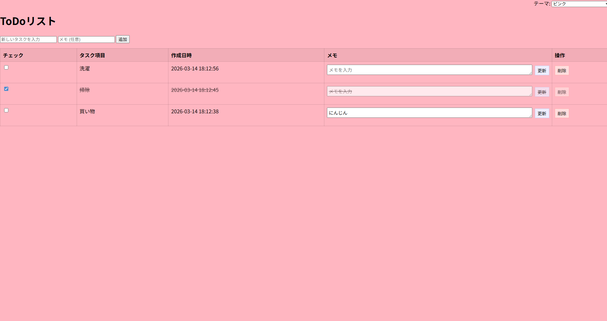

# todo-app
# PHP TODOアプリ

PHPとMySQLで作成したシンプルなタスク管理アプリです。

## 機能

・タスク追加
・タスク削除
・タスク一覧表示
・メモ機能
・チェック機能
・背景スタイル変更

## 使用技術

・PHP
・MySQL
・HTML
・CSS

# DB設計
tasks
- id
- title
- created_at
- descripiton
- completed

# Screenshot

# URL
http://localhost/todo-app

## 今後追加予定
・ログイン機能

